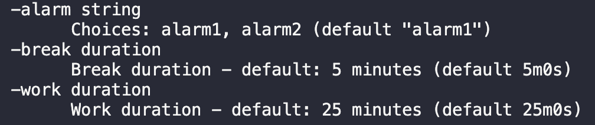

# GoPomodoro

Cli Application built for using the <a href="https://en.wikipedia.org/wiki/Pomodoro_Technique">Pomodoro Technique</a>

## 📚 Table of Contents
1. [Demo](#demo) 
2. [Current Flags](#current-flags)
3. [Future Deliverables](#future-deliverables)
4. [Resources](#resources)

# Demo 

Check out my video demo <a href="https://share.vidyard.com/watch/NSg1J9ipgV11QiyFi37kWG?">here</a>

## Current Flags

</img>

<ul>
    <li>-alarm sets the alarm you want to play 
        
usage: -alarm="alarm1"

    </li>
    <li> -break sets the duration of your break alarm 
        
usage ex: -break="5s"

    </li>
    <li>-work sets the duration of your work alarm 
        
usage ex: -work="5s"

    </li>
</ul>

## Future Deliverables 

- Implement a FSM for alternating timers
- Adding checkpoint system
